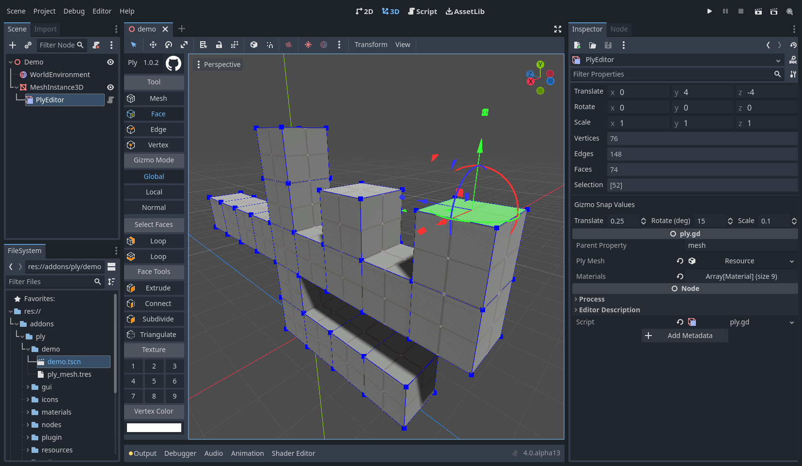

#  godot-ply 
Godot plugin for in-editor box modeling for grayboxing or prototyping 3d levels.



Only tested in Godot 3.4. Icons are only good for dark mode.

See demos [on youtube](https://www.youtube.com/channel/UCf1IV6ABf3a4nW1wEyPwmMQ).

## Installation
- Copy the contents of the plugin directory in this repository into your `addons` folder for your godot project.
- Activate the plugin in your project settings.

## Usage
Create a  PlyEditor node as the child of a MeshInstance or CSGMesh and select it.

### Editing Meshes
There are four selection modes:
-  ` 1 ` Mesh
-  ` 2 ` Face
-  ` 3 ` Edge
-  ` 4 ` Vertex

And three gizmo modes:
- Global - Translate/Rotate/Scale along global coordinates
- Local - Translate/Rotate/Scale along model local coordinates
- Normal - Translate/Rotate/Scale along coordinates aligned to the average normal of the selected geometry

The gizmo behaves much like the standard Godot gizmo, however it includes scale handles by default.
- Translate Axis: Arrows
- Translate Plane: Squares
- Rotate Around Axis: Arcs
- Scale Axis: Cubes
- Scale Plane: Triangles

The inspector includes translate/rotate/scale tools for fine tuning, which respect the selected gizmo mode.

There are tools for each selection mode:
- Mesh
    - Mesh Tools
        - Subdivide: Subdivide all quads/tris into four quads/tris
        - Triangulate: Triangulate all faces using an ear clipping algorithm
    - Mesh Utilities
        - Export to OBJ: Exports the selected mesh to an OBJ file
            - Currently just exports basic geometry, excluding normals, materials, etc
        - Quick Generators
            - Plane: Generate a two-sided unit plane
            - Cube: Generate a unit cube
        - Generate: Opens a modal for more advanced generation
            - Plane: Generate a plane with specified size and subdivisions
            - Cube: Generate a cube with specified size and subdivisions
            - Isosphere: Generate a isosphere with specified radius and subdivisions
            - Cylinder: Generate a cylinder with specified radius, depth, circle vertex count, and 

- Face
    - Select Faces
        -  Loop: a quad loop in one direction
        -  Loop: a quad loop in the other direction
    - Face Tools
        -  ` ctrl-e ` Extrude: Extrudes the selected face(s) along their mean normal by 1 unit
        - Connect: Remove the two selected faces, creating a new face between edges. Tries to select an edge pairing that works.. but not always.
        - Subdivide: Subdivide a quad or a tri into 4 quads or 4 tris
        - Triangulate: Triangulates a face using an ear clipping algorithm
    - Paint Faces: Moves the selected face to the selected surface, allowing multiple materials per Ply Instance. Assign materials to the parent MeshInstance.
- Edge
    - Select Edges
        -  Loop: Select an edge loop from the given edge
    - Edge Tools
        -  ` ctrl-r ` Cut Loop: Add a loop cut perpindicular to the selected edge
        -  Subdivide: Splits the selected edge into two parallel edges
        -  Collapse: Collapses an edge into a single vertex at its midpoint
- Vertex
    - None, yet!

### Collisions
Collision meshes are updated automatically if there is a CollisionShape child of the parent MeshInstance node at `$StaticBody/CollsionShape`. This is the default naming if you use the `Create Trimesh Static Body` tool in the .

## Details
Meshes are meant to only be oriented manifolds. Some properties:
- Each edge has one or two faces (although we generally use exactly 2)
- All of an edge's faces have compatible orientation -- that is the edge origin and destination are in opposite order for opposite faces.

Ply uses a winged edge representation for edges, but omit counterclockwise navigation:
```
omitted
left ccw        right cw
         \     /
          \   /
           \ /
            o destination
            ^
            |
left face   |   right face
            |
            o origin
           / \
          /   \
         /     \
left cw          right ccw
                 omitted
```

### Implications
Given this representation, a few limitations occur that are representable in other tools:
- One cannot abritrarily extrude edges into one-sided faces, or one edge would be incident with >2 faces.
- One cannot flip individual faces, as the faces would no longer have compatible orientation.

### Plugin Interop
Uses [godot-plugin-interop](https://github.com/jarneson/godot-plugin-interop) to allow other plugins to access it.

## Contributing

Feel free to contribute! Both issues and pull requests are very welcome.

Feel free to contact me on the [godot discord server](https://discord.gg/4JBkykG), where my name is `hints`
